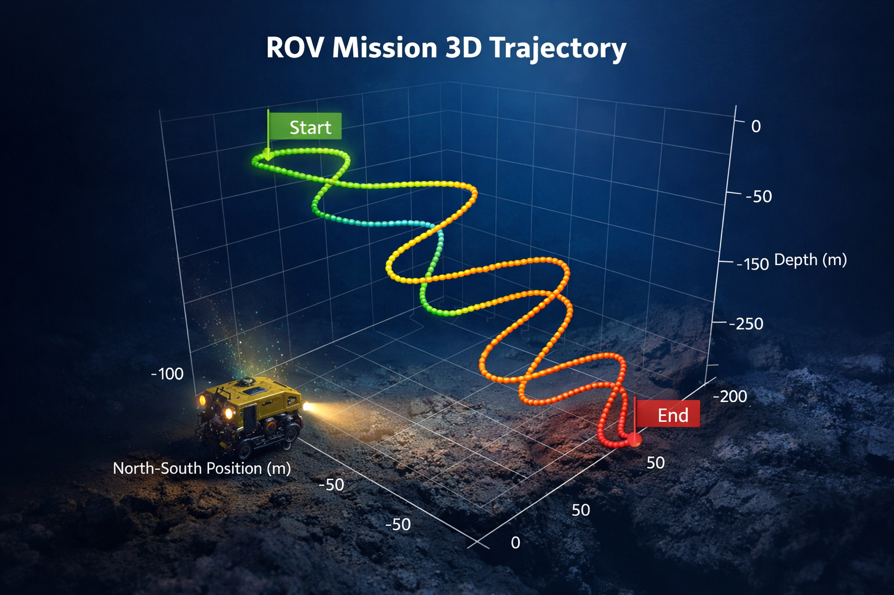

# ROV 3D Mission Path Visualizer

This project visualizes the trajectory of an ROV during a mission using a 3D interactive chart.

## Technologies

Python  
Streamlit  
Plotly  
Pandas  

## Features

- 3D visualization of mission trajectory
- Depth visualization
- Interactive rotation and zoom

  
